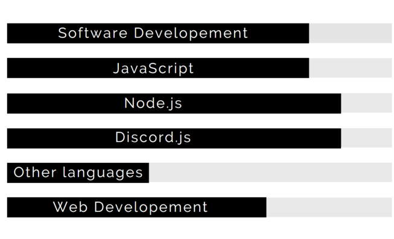

# Muffin

## Who I am, and about me

### I am a Discord bot developer (as a junior software engineer) and I do programming to improve myself, and it is my hobby.

 

## Which languages do I know or am learning?
### I mainly work with JavaScript, but here are the languages and libraries I use:

 

### Languages and libraries I am using:

 

- JavaScript
- [Discord.js](https://discord.js.org)
- [Node.js](https://nodejs.org/)

 

### Languages I am learning:

- Java
- C++

 

## What are my projects and what am I working on?
### I have many completed or done projects like Discord bots and much more, but I currently have one Discord bot project, that is mostly done, but I am still working on it and improving it.

### You can check my bot, **Delight** [here](https://sites.google.com/view/delightbot/)

 

## My Skills
### You can see my skill levels with this chart that indicated my skill levels according to my experiencde and knowlede.

### My Contacts:
- Discord: muffin.#2907
- Github: Muffin717

